# 📱 Pothole Detection App


## Project Introduction
We have built a mobile application that detects potholes using sensor data from smartphones, including the accelerometer, gyroscope, and GPS. The app automatically collects motion and location data while users are driving and analyzes it in real-time to identify potholes. When a pothole is detected, the app records its location and sends instant alerts to the user.
In addition to automatic detection, the app allows users to manually report potholes and view all pothole locations on an interactive Mapbox-based map. Users can also review historical reports, customize detection sensitivity, and switch between languages. The application supports offline data storage and can optionally sync with a backend server for data sharing and analysis.

[Watch the Intro](https://github.com/1307Bao/PotholeDetector/blob/master/demo/video/Demo.mp4)


<video controls>
  <source src="Intro.mp4" type="video/mp4">
  <source src="Detail.webm" type="video/webm">
  <source src="Demo.ogv" type="video/ogg">
  Your browser does not support the video tag.
</video>


## Team Members
| ID        | Name         |
| :-------- | :----------- |
| 22520112  | Nguyễn Thái Bảo |
| 22520031  | Trần Thúy An |

## Database Schema 
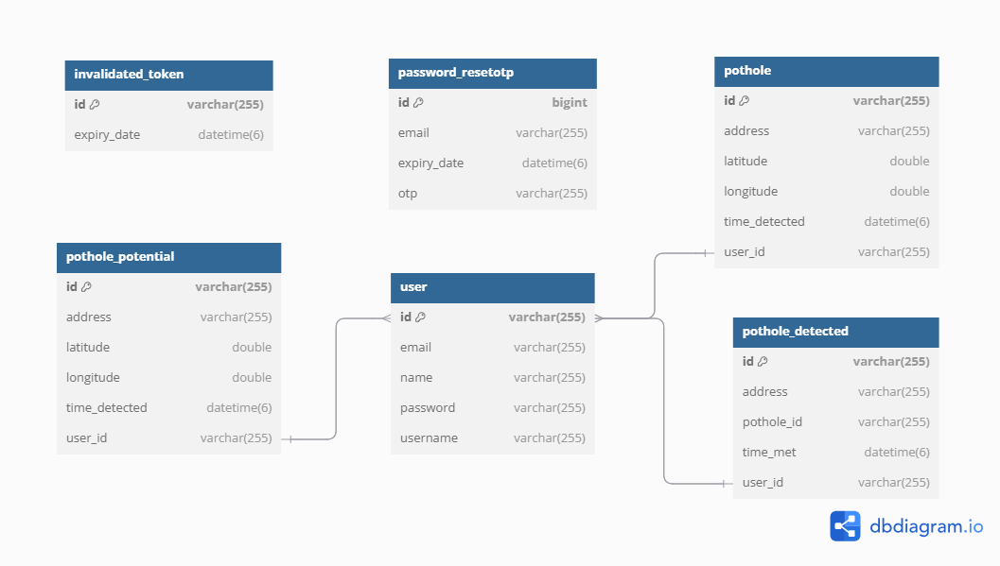

## Main Features for Users
> * 📍 Pothole Detection using real-time accelerometer and GPS data
> * 🗺️ Map Integration to visualize pothole locations
> * 🔔 Real-time Notifications to warn users of detected potholes
> * 🧠 Data Analysis to identify unusual vibrations
> * 📦 Local Data Storage for offline access
> * 📊 Statistics & Reports for road quality analysis
> * 🌐 Multilingual Support (English & Vietnamese)
> * ⚙️ Custom Settings for sensitivity, theme, and language

## Data Flow & Architecture
- Real-time sensor data → local service → anomaly detection algorithm → map update + notification
- Optionally syncs to backend for long-term storage and analytics

## 📷 Demo of Some Interfaces
- Splash & Select Language
<div float="left" align="center" >
  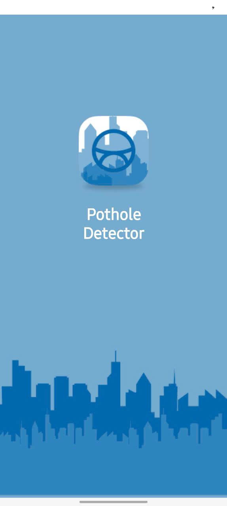
  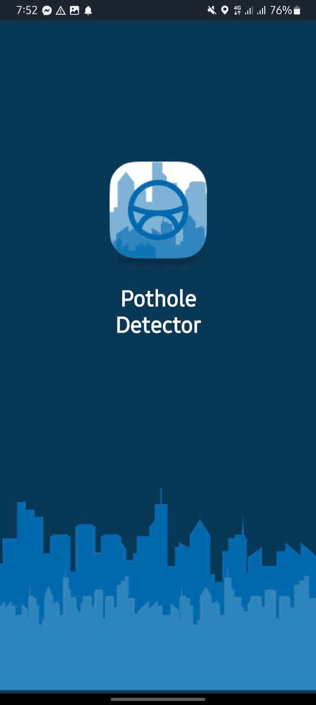
   
   
</div>

 - 🔐 Authentication 
<div float="left" align="center" >
  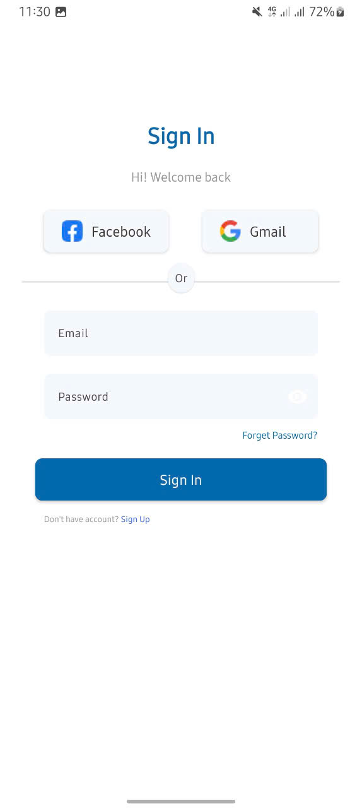
  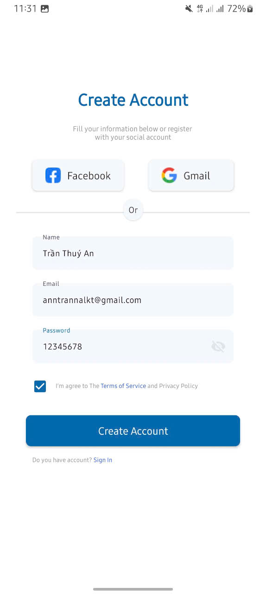 
  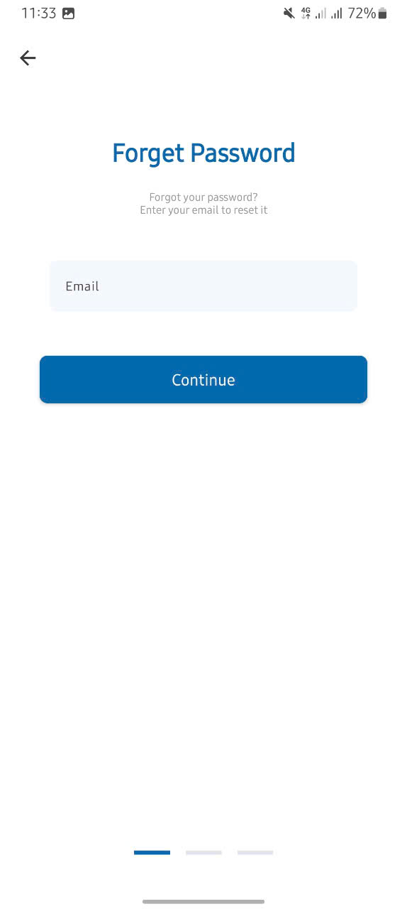
  
</div>
<div float="left" align="center" >
  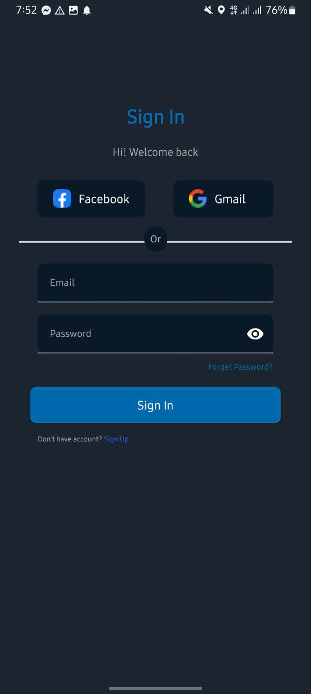
  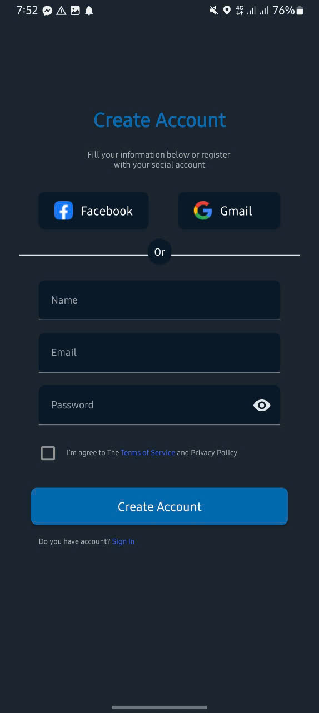 
  
  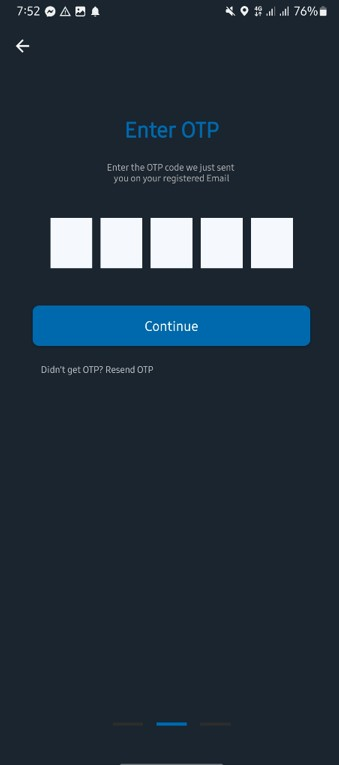
</div>

- 🏠 Home Screen
<div float="left" align="center" >
  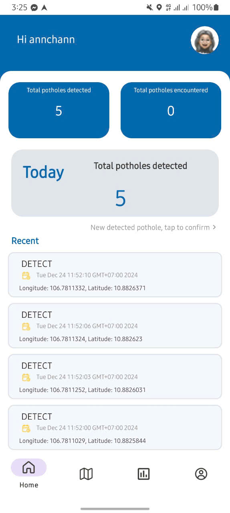
  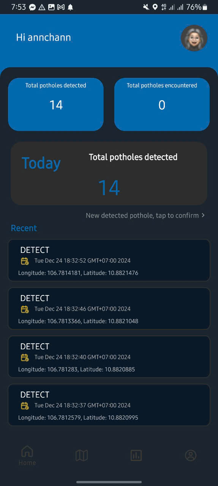 
  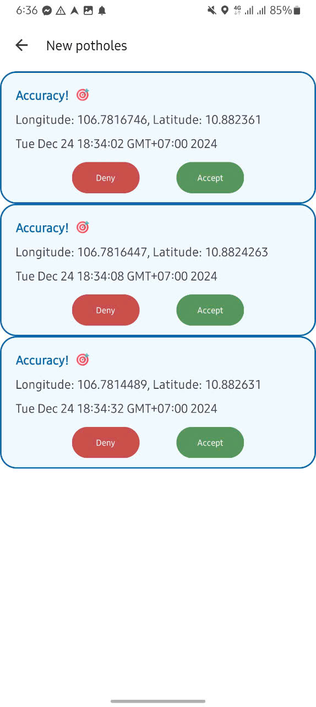
  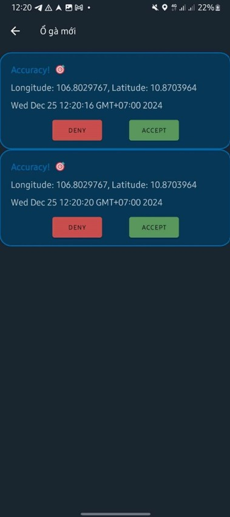
</div>

- 🗺️ Map View & 📝 Report
<div float="left" align="center" >
  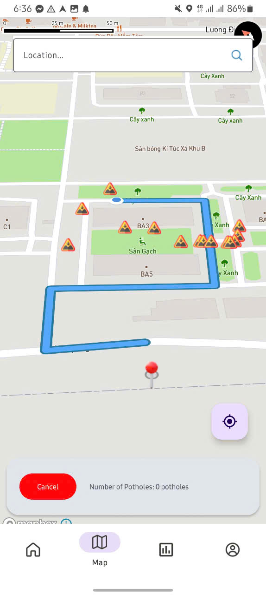
  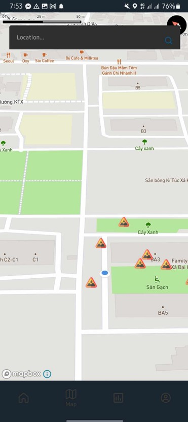 
  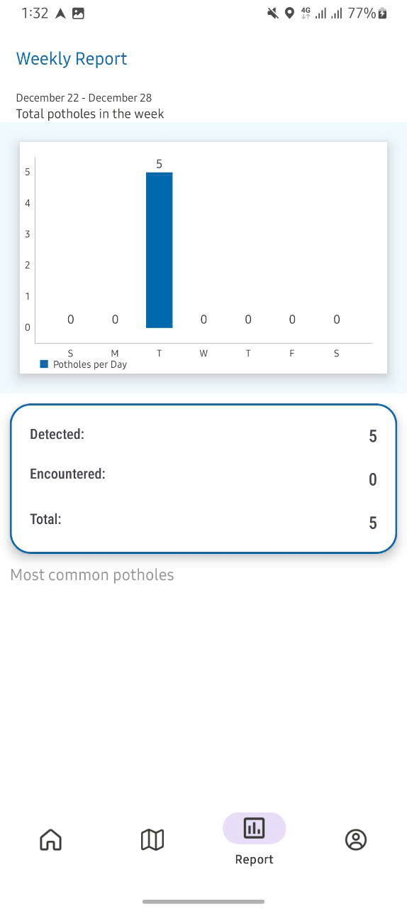
  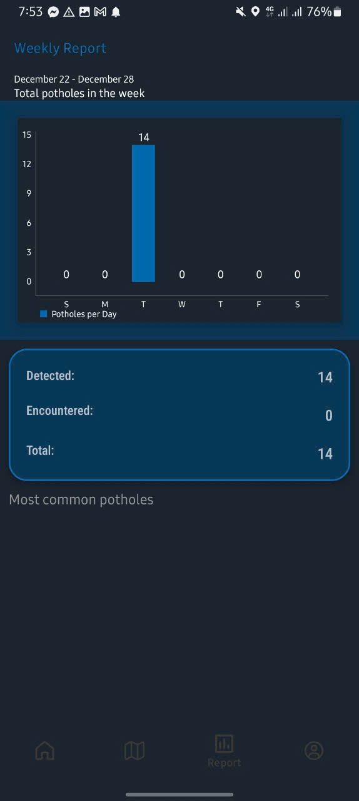
</div>

- ⚙️ Settings
<div float="left" align="center" >
  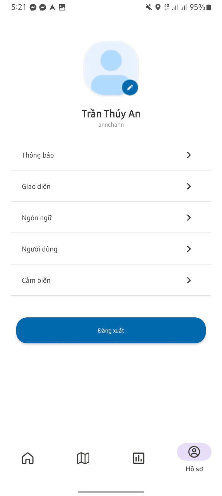
  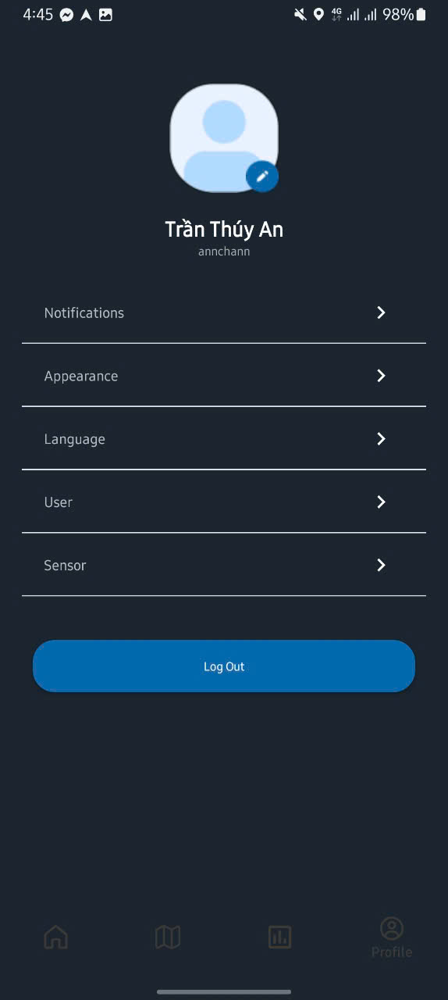 
  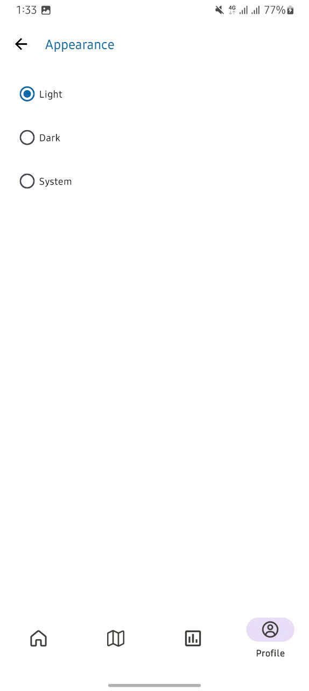
  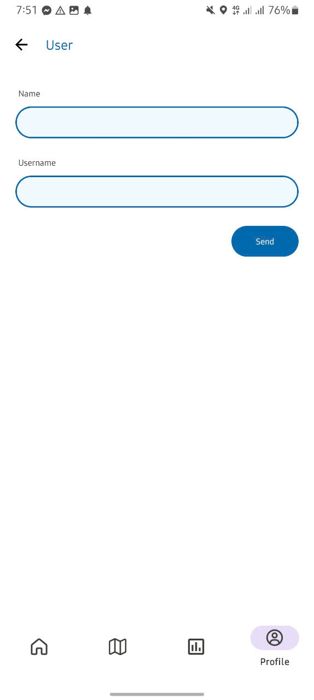
</div>


[](https://github.com/1307Bao/PotholeDetector/tree/master/demo/Intro.mp4)
[](https://github.com/1307Bao/PotholeDetector/tree/master/demo/Detail.mp4)
[](https://github.com/1307Bao/PotholeDetector/tree/master/demo/Demo.mp4)


## 🧪 Technologies Used
- **Languages:** Java (Android & Backend)
- **Backend:** Spring Boot, MySQL
- **Frontend:** Android (Java), Mapbox SDK
- **IDE:** Android Studio, IntelliJ IDEA
- **Networking:** Retrofit
- **Security:** JWT, Spring Security
- **Version Control:** Git, GitHub


## 🛠 Installation Guide

### Prerequisites
- Android Studio (latest version)
- JDK 11 or above
- MySQL 8.0+
- Android device (Android 7.0+)

### 📥 Clone the Project
```git clone https://github.com/1307Bao/PotholeDetector.git```

### 📱 Setup Frontend
1. **Clone the repository and navigate to the frontend directory:**
- Open Android Studio → File > Open → select the frontend folder.
- Android Studio will sync dependencies automatically.
- Update ApiClient.java with your backend IP: ```String BASE_URL = "http://<your_local_ip>:8080";```

### 🖥️ Setup Backend
1. Open the backend folder in IntelliJ.

2. In application.yaml, update your MySQL config:
   ```
    spring:
        datasource:
            url: jdbc:mysql://localhost:3306/YOUR_DATABASE_NAME
            username: YOUR_USERNAME
            password: YOUR_PASSWORD
    ```

### 📲 Run the App
- Connect your Android device or launch an emulator.
- In Android Studio, press Shift + F10 to build and run.

>* ***📝Note:** Refer to the installation guide file below for a clearer understanding: [Detailed Guide File](./demo/Huong-dan-cai-dat-Pothole-Detector.docx)*
