# 📱 Pothole Detection App

A mobile application that detects potholes on the road using smartphone sensor data (accelerometer, gyroscope, GPS). It provides real-time alerts and displays pothole locations on a map.


## Team Members
| ID        | Name         |
| :-------- | :----------- |
| 22520112  | Nguyễn Thái Bảo |
| 22520031  | Trần Thúy An |

## Database Schema 


## Main Features for Users
> * 📍 Pothole Detection using real-time accelerometer and GPS data
> * 🗺️ Map Integration to visualize pothole locations
> * 🔔 Real-time Notifications to warn users of detected potholes
> * 🧠 Data Analysis to identify unusual vibrations
> * 📦 Local Data Storage for offline access
> * 📊 Statistics & Reports for road quality analysis
> * 🌐 Multilingual Support (English & Vietnamese)
> * ⚙️ Custom Settings for sensitivity, theme, and language

## Data Flow & Architecture
- Real-time sensor data → local service → anomaly detection algorithm → map update + notification
- Optionally syncs to backend for long-term storage and analytics

## 📷 Demo of Some Interfaces
- Splash & Select Language
<div float="left" align="center" >
  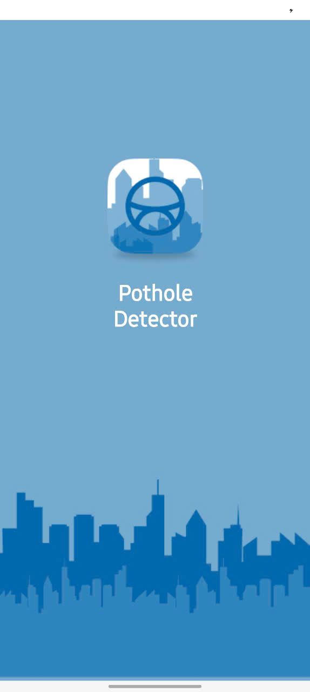
  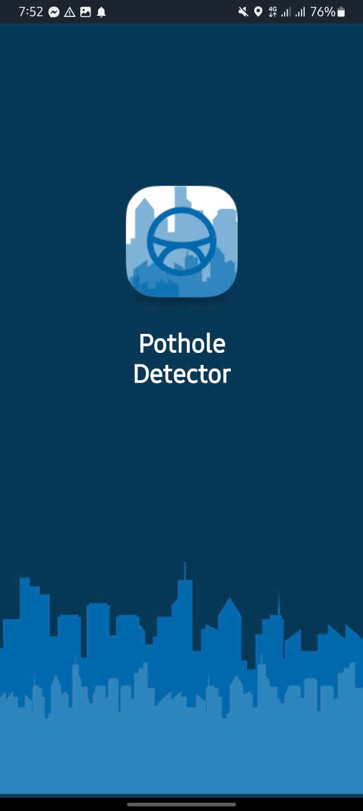
   
   
</div>

 - 🔐 Authentication 
<div float="left" align="center" >
  
   
  
  
</div>
<div float="left" align="center" >
  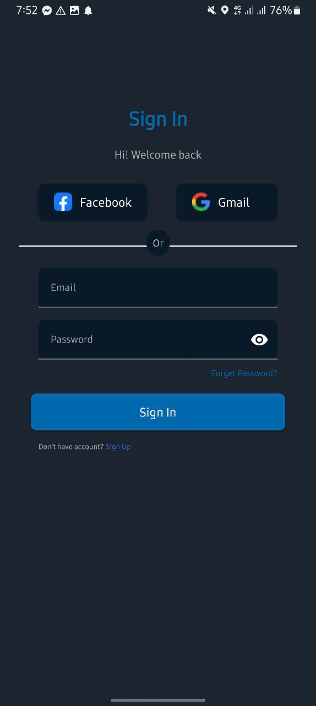
   
  
  
</div>

- 🏠 Home Screen
<div float="left" align="center" >
  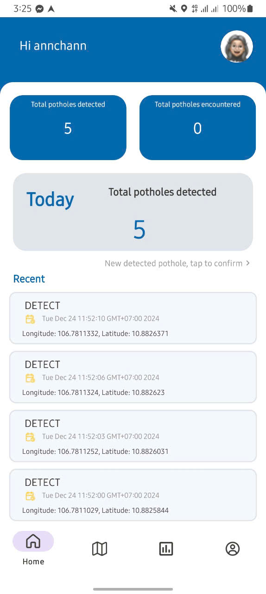
  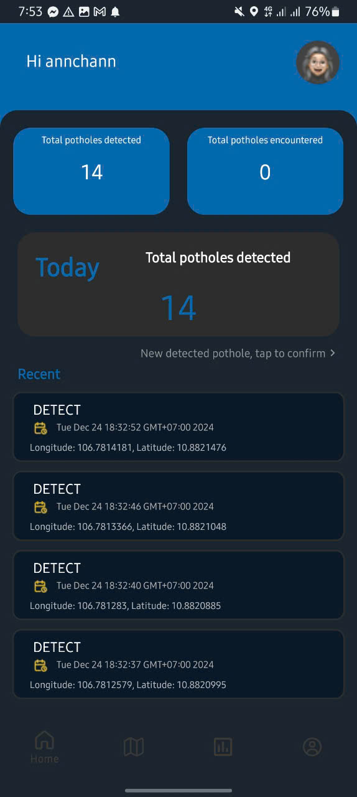 
  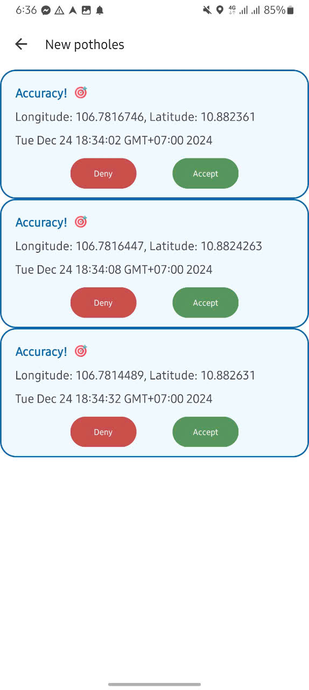
  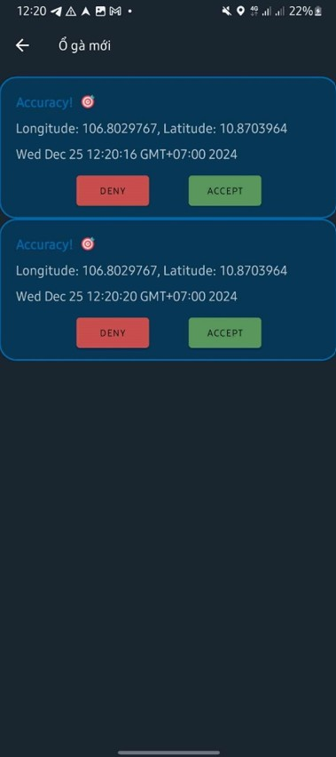
</div>

- 🗺️ Map View & 📝 Report
<div float="left" align="center" >
  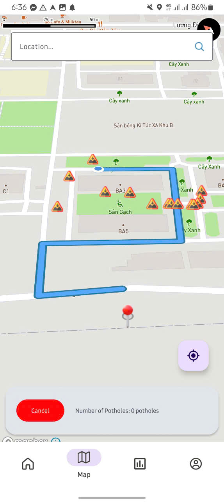
  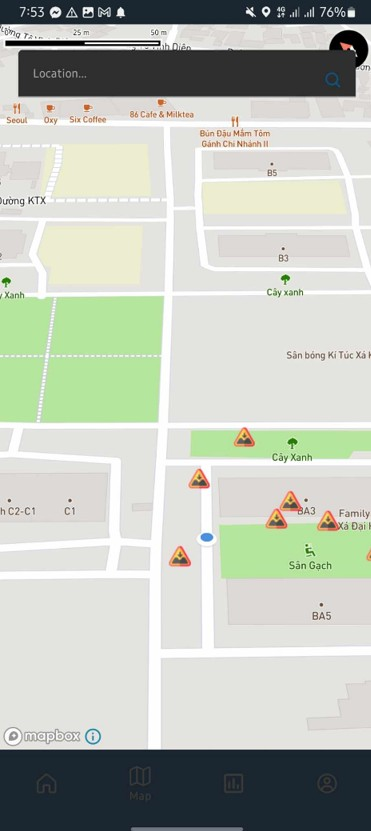 
  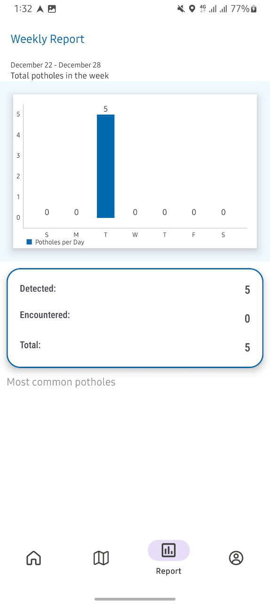
  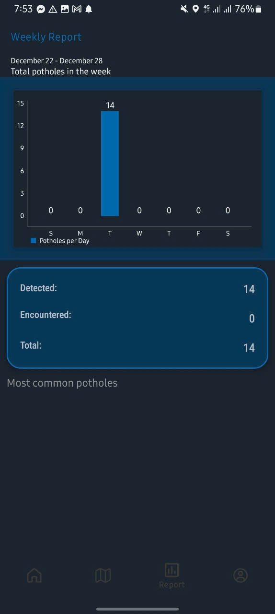
</div>

- ⚙️ Settings
<div float="left" align="center" >
  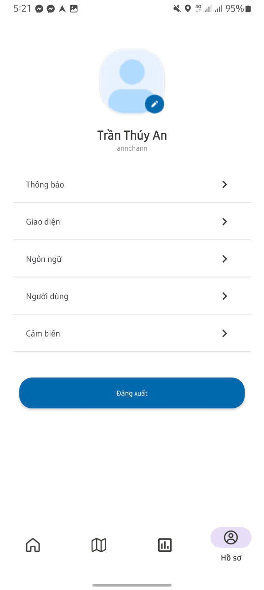
  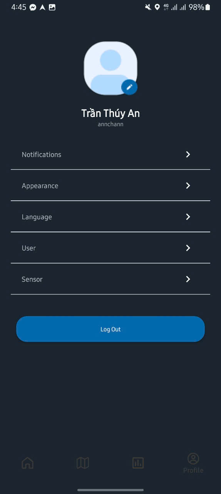 
  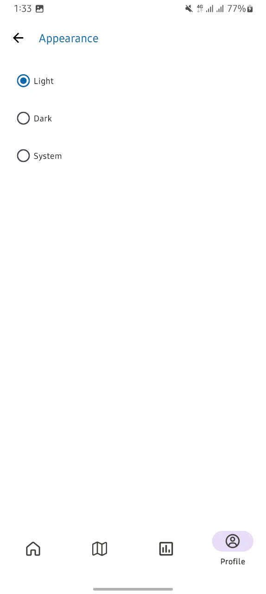
  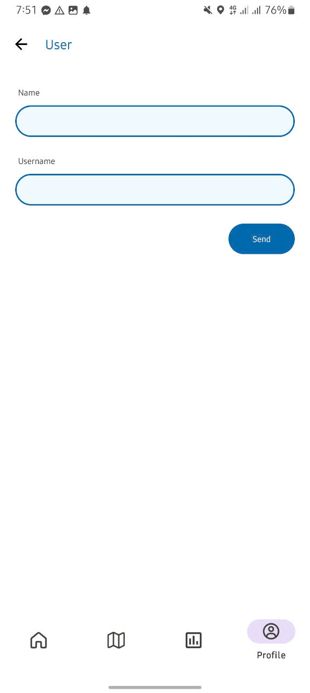
</div>


## 🧪 Technologies Used
- **Languages:** Java (Android & Backend)
- **Backend:** Spring Boot, MySQL
- **Frontend:** Android (Java), Mapbox SDK
- **IDE:** Android Studio, IntelliJ IDEA
- **Networking:** Retrofit
- **Security:** JWT, Spring Security
- **Version Control:** Git, GitHub


## 🛠 Installation Guide

### Prerequisites
- Android Studio (latest version)
- JDK 11 or above
- MySQL 8.0+
- Android device (Android 7.0+)

### 📥 Clone the Project
```git clone https://github.com/1307Bao/PotholeDetector.git```

### 📱 Setup Frontend
1. **Clone the repository and navigate to the frontend directory:**
- Open Android Studio → File > Open → select the frontend folder.
- Android Studio will sync dependencies automatically.
- Update ApiClient.java with your backend IP: ```String BASE_URL = "http://<your_local_ip>:8080";```

### 🖥️ Setup Backend
1. Open the backend folder in IntelliJ.

2. In application.yaml, update your MySQL config:
   ```
    spring:
        datasource:
            url: jdbc:mysql://localhost:3306/YOUR_DATABASE_NAME
            username: YOUR_USERNAME
            password: YOUR_PASSWORD
    ```

### 📲 Run the App
- Connect your Android device or launch an emulator.
- In Android Studio, press Shift + F10 to build and run.

>* ***📝Note:** Refer to the installation guide file below for a clearer understanding: [Detailed Guide File](./demo/Huong-dan-cai-dat-Pothole-Detector.docx)*
